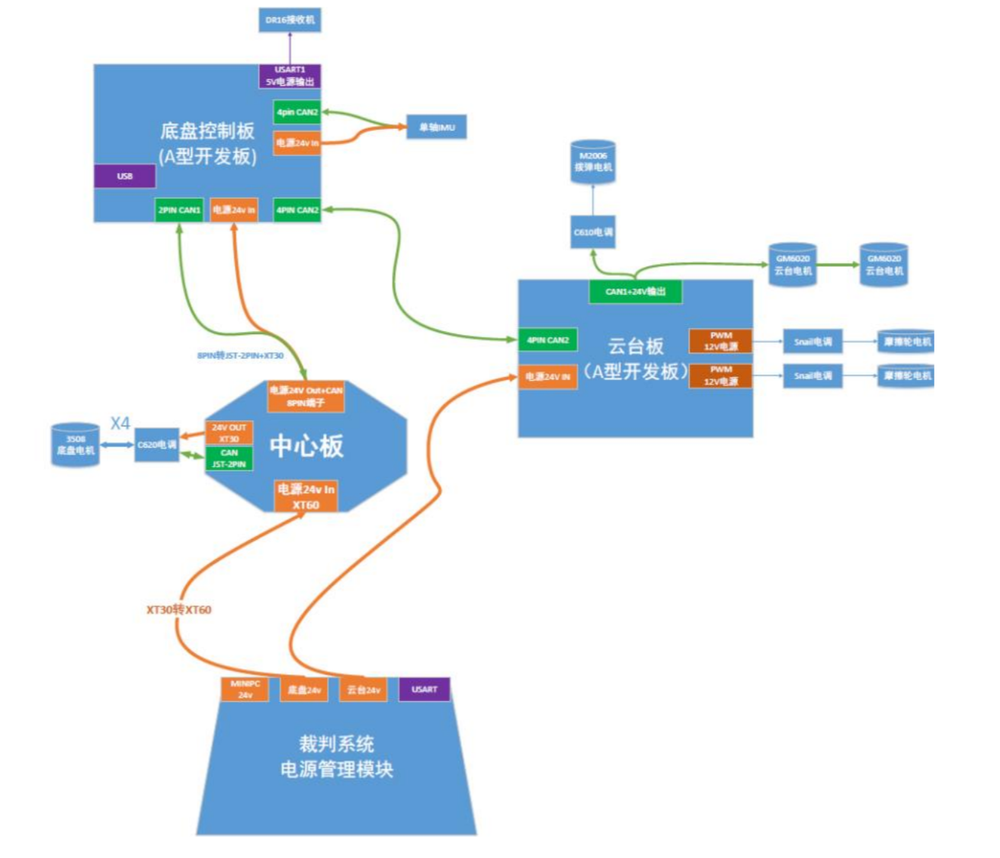

## 概述

- en doc   [readme](doc/en/readme.md)

### 软件环境

 - Toolchain/IDE : MDK-ARM V5
 - package version: STM32Cube FW_F4 V1.21.0
 - FreeRTOS version: 9.0.0
 - CMSIS-RTOS version: 1.02

### 编程规范

- 变量和函数命名方式遵循 Unix/Linux 风格
- chassis\_task与gimbal\_task是强实时控制任务，优先级最高，禁止被其他任务抢占或者阻塞
- 不需要精确计时的任务，采用自行实现的软件定时器实现，定时精度受任务调度影响

### 注意事项

1.由于发射机构触动开关阻力非常小，轻微转动拨弹电机就可能造成子弹越过触动开关触碰摩擦轮，导致摩擦轮摩擦过大无法启动，**造成摩擦轮磨损和电机启动失败**。因此，开电前务必检查是否有子弹已经越过触动开关。**取出办法**：用手按住一侧摩擦轮，旋转另一个摩擦轮。

2.由于snail电机初始化未成功时，电机产生叫声的频率在角速度响应范围内，会极大的干扰云台控制，导致无法正常控制。**解决方法**：可以对陀螺仪数据采用**带阻滤波**解决。（本版本未加入）

3.在云台控制逻辑中，考虑到调试视觉识别装甲时可能需要发射子弹功能，所以自动模式下开放了单发功能。但如果在单发后没有将左拨杆回中，会导致在从自动模式下切回手动模式立刻触发连发模式。因此，**在自动模式下单发之后务必保证将拨杆拨回中间位置。**

4.国际开发板A型上有一枚跳线帽，用于短接板载4pin排针串口R与G（只有底盘需要短接R和G）。固件通过R引脚是否拉低区分底盘还是云台。出现不能控制且无声光报警请检查跳线帽是否松动

### 云台校准方法

底层代码集成了云台自动校准功能，原理是先利用imu校准pitch，控制云台保持在水平面，当误差小于0.15度时，记录pitch中值，此过程大概花费20~30s；然后YAW向左旋转直到触碰左侧限位，再向右旋转至右侧限位，计算YAW中值。

触发条件：

1.开发板首次刷入程序或者参数区被清空

2.按下板载白色按键触发

3.上位机发送协议命令触发

注意：校准时务必将底盘放在水平地面；校准中可能出现pitch始终无法到达指定误差范围内，此时是因为云台配重问题导致，可以用手向上掰一下然后松开云台，加速调节过程。

### 模块离线说明

当车辆的某个模块离线时，可以根据开发板蜂鸣器的不同状态判断哪个模块出现了问题，并进行错误定位

蜂鸣器鸣叫次数按照离线模块的优先级进行错误指示，例如云台电机优先级高于拨弹电机，如果同时发生离线，先指示当前离线设备是云台电机

模块离线对应的状态如下，数字对应蜂鸣器每次鸣叫的次数，按照优先级排序：

#### 底盘模块

1. 右前轮电机掉线
2. 左前轮电机掉线
3. 左后轮电机掉线
4. 右后轮电机掉线

#### 云台模块

5. 云台 YAW 电机掉线
6. 云台 PITCH 电机掉线
7. 拨盘电机掉线
8. 单轴陀螺仪掉线

#### 遥控器离线

此时红灯常亮

### 文档

- 协议文档  [protocol](doc/ch/protocol.md)
- protocol [document](doc/en/protocol.md)

## 快速开始

### 硬件接口

主控板使用 RM 开发板 A 型，各个功能接口的位置如下：

#### 两板布线方式

**底盘硬件接口** 

注意：uwb、单轴陀螺仪、通信can2硬件上使用一个can，无需考虑接线顺序。

**云台硬件接口**

### 功能模块

#### 手动模式：

提供遥控器基础控制。

#### 全自动模式：

这种模式下底盘、云台、发射机构受到上层 PC 的完全控制，完全控制包含对这些执行机构以具体物理单位的控制。

#### 操作档位说明：

##### 手动档

遥控器控制（底盘跟随云台）：右拨杆上
遥控器控制（云台跟随地盘）：右拨杆中

- 开、关摩擦轮（左拨杆上拨）
- 单发、连发射击（左拨杆下拨）

##### 自动档

正常比赛时使用（拨杆右下）

左拨杆位置对应功能：

- 上：摩擦轮打开，其他全接管
- 中：摩擦轮关闭，其他全接管
- 下：只具有单发功能

## 程序说明

### 程序体系结构

#### 体系框架

1. 使用免费及开源的 freertos 操作系统，兼容其他开源协议 license；
2. 使用标准 CMSIS-RTOS 接口，方便不同操作系统或平台间程序移植；
3. 提供一套抽象步兵机器人bsp，简化上层逻辑；

**Driver**：直接操作底层硬件的设备驱动，在库函数和寄存器基础上，增加锁和异步等机制,提供更加易于使用的api。

**Device**：具有一种或者多种总线输入，一种或者多种数据输出的外部模块，或者通用的软件模块（掉线保护）。目前主要针对RM物资的驱动抽象成设备。

**Controller**：单输入单输出模型，提供一些公用的调用接口，更换不同的控制算法取决于不同的注册函数。

**Algorithm**：提供模块算法，基本文件间无相互依赖。

**Module**：由driver、device、controller、algorithm组成的，可以实现某种特殊功能的模块。比如RM电机组成的二轴云台、RM电机构成的麦轮底盘。

**Utilities**：通用系统组件，比如log系统。

**Protocol**：面向接口的一套上层和底层通信协议。

**Application**：上层应用逻辑，包括各类模式切换。

### 软件体系

#### 程序启动

程序启动通过国际开发板A型的跳线帽区分启动任务

### 继承关系

### 硬件体系

1. 主控 MCU：STM32F427IIHx，配置运行频率180MHz
2. 模块通信方式：CAN；CAN设备：电机电调、陀螺仪模块
3. 上下层通信方式：USB虚拟串口
4. 麦轮安装方式：X型

### 协议数据

#### 数据分类

协议数据按照通信方向可以分为两大类：

底层发送给上层的数据：

1. 反馈信息：包含各个机构传感器反馈信息、底层计算出来的一些反馈信息；
2. 底层状态信息：包含底层设备运行状态、底层对上层数据的一些响应等；
3. 转发数据：包含裁判系统的全部信息、服务器端的自定义信息；

底层接收的上层数据：

1. 控制信息：上层对底层 3 个执行机构的控制信息；

